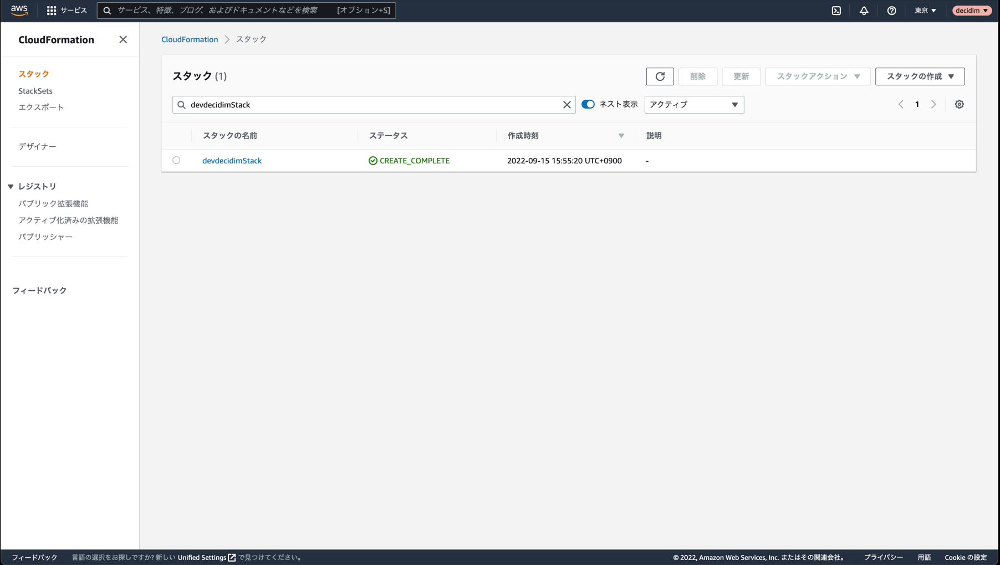

# 検証環境構築手順

# 1. AWS (Amazon Web Services) へのアクセスする準備

## 1-1. config/dev.json の作成

[dev.json](../config/dev.json) ファイルを作成し、[config](../config) ディレクトリ下に配置。

## 1-2. credentials fileの作成

[設定ファイルと認証情報ファイルの設定](https://docs.aws.amazon.com/ja_jp/cli/latest/userguide/cli-configure-files.html)を参考に、credentialsファイルを作成する。


今回は、`~/.aws/credentials`に以下のようprofileが`decidim`になるよう作成。（違う名前にした場合、以下読み変えが必要です。）
```
[decidim]
aws_access_key_id=YOUR_ACCESS_KEY
aws_secret_access_key=YOUR_SECRET_ACCESS_KEY
```

# 2. SESの設定
[Amazon Simple Email Service を設定する](https://docs.aws.amazon.com/ja_jp/ses/latest/dg/setting-up.html)や、[Setup email](https://docs.aws.amazon.com/ja_jp/ses/latest/dg/setting-up.html)を参考に、AWS SESの準備を行う。

# 2-1. [dev.json](../config/dev.json) を編集する
[dev.json](../config/dev.json)の’smtpDomain’を用意したドメインに書き換える。


# 3. パラメータストアに環境変数を登録する

# 3-1 シークレットの作成
AWS Systems Manager のパラメータストアで以下のようなパラメータを手動で作成する。

```
  /decidim-cfj/${props.stage}/AWS_ACCESS_KEY_ID
  /decidim-cfj/${props.stage}/AWS_SECRET_ACCESS_KEY
  /decidim-cfj/${props.stage}/AWS_CLOUD_FRONT_END_POINT
  /decidim-cfj/${props.stage}/RDS_DB_NAME
  /decidim-cfj/${props.stage}/RDS_USERNAME
  /decidim-cfj/${props.stage}/RDS_PASSWORD
  /decidim-cfj/${props.stage}/SECRET_KEY_BASE
  /decidim-cfj/${props.stage}/NEW_RELIC_LICENSE_KEY
  /decidim-cfj/${props.stage}/SMTP_ADDRESS
  /decidim-cfj/${props.stage}/SMTP_USERNAME
```

# 4. ECRの準備

# 4-1 プライベートリポジトリを作成する
[プライベートリポジトリを作成する](https://docs.aws.amazon.com/ja_jp/AmazonECR/latest/userguide/repository-create.html) を参考に AWS ECRのリポジトリを用意する。

# 4-2 用意したリポジトリにdecidim の docker imageをpushする
手元の環境で、[decidim-cfj](https://github.com/codeforjapan/decidim-cfj)のdocker imageをbuildし、
[Docker イメージをプッシュする](https://docs.aws.amazon.com/ja_jp/AmazonECR/latest/userguide/docker-push-ecr-image.html)を参考に
buildしたdocker imageを用意したリポジトリにpushする。

# 4-3 [dev.json](../config/dev.json) を編集する
[dev.json](../config/dev.json)の’repository’部分に用意したECRリポジトリ名、’tag’部分にpushした際のtagに書き換える。

# 5. 証明書の準備

# 5-1 任意のドメインをroute53に用意し、aws certificate managerで証明書を発行する
[証明書を発行して管理する](https://docs.aws.amazon.com/ja_jp/acm/latest/userguide/gs.html)を参考に証明書を発行、Arnをメモする

# 5-2 [dev.json](../config/dev.json) を編集する
[dev.json](../config/dev.json)の’certificates’部分にメモしたArnに書き換える。

# 6. デプロイ

## 6-1. cdk bootstrap の実行

使用するリージョンごとに一回実行する必要がある。2回目以降は不要。

```console
$ npx cdk --context stage=dev --profile decidim bootstrap
```

## 6-2. デプロイ前の差分確認

どんなリソースが作成されるのかを確認できる。

```console
$ npx cdk --context stage=dev --profile decidim diff  
```

## 6-3. デプロイ実行

```console
$ npx cdk --context stage=dev --profile decidim deploy --all  --require-approval never
```

上記コマンドが成功すれば、デプロイは成功です。

## 6-4. デプロイ確認

`devdecidimStack` とCloudFormationのスタック一覧から[検索](https://ap-northeast-1.console.aws.amazon.com/cloudformation/home?region=ap-northeast-1#/stacks?filteringStatus=active&filteringText=devdecidimStack&viewNested=true&hideStacks=false&stackId=)し、以下のように各Stackに`CREATE_COMPLETE`が表示されていることを確認してください。



# 7. 初回デプロイ 

## 7.1 環境へのアクセス
```console
$ aws ecs execute-command --region ap-northeast-1 --cluster devDecidimCluster --task ${タスク名} --container appContainer --interactive --command "/bin/ash" --profile decidim
```

## 7.2 migrateとseedの実行
```console
$ ./bin/rails db:migrate
$ ./bin/rails db:seed SEED=true
```

## 7.3 環境へのアクセス
``dev-decidim-alb-origin.${指定したドメイン}``で管理画面にアクセス


